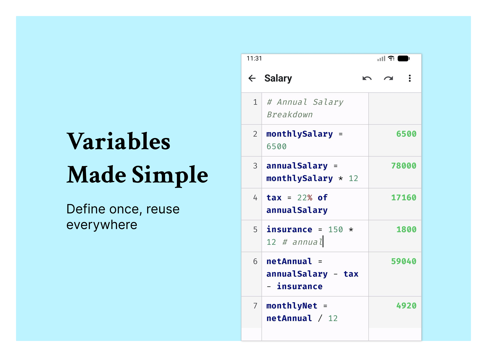
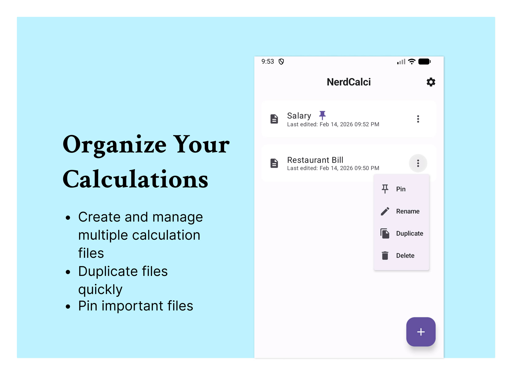

<h1 align="center">NerdCalci</h1>

<p align="center">
  
</p>

<p align="center">
  <strong>Fully offline Android calculator app for power users with variable support, syntax highlighting, file-based sessions, and more.</strong>
</p>

## Screenshots

<p align="center">
  
  
  
</p>
<p align="center">
  
  
  
</p>

## Features

### Smart Calculations
- **Variable Support**: Define variables and use them in calculations
  ```
  a = 100
  b = 200
  total = a + b  # 300
  ```
- **Percentage Calculations**: Natural percentage syntax
  ```
  20% of 50000    # 10000
  15% off 1000    # 850
  50000 + 10%     # 55000
  50000 - 5%      # 47500
  ```
- **Comments**: Add notes with `#` symbol
  ```
  price = 1000  # base price
  tax = 18% of price  # 180
  ```
- **Mathematical Functions**: Built-in support for common math functions (see [exp4j documentation](https://redmine.riddler.com.ar/projects/exp4j/wiki/Built_in_Functions) for more details)
  ```
  sqrt(16)           # 4
  sqrt 16            # 4
  sin(pi/2)          # 1
  log10(1000)        # 3
  pow(2, 8)          # 256
  abs(-42)           # 42

  # Calculate circle area
  radius = 5
  area = pi() * pow(radius, 2)  # 78.54

  # Convert degrees to radians and calculate sine
  degrees = 45
  radians = degrees * pi / 180
  result = sin(radians)  # 0.71

  # Exponential growth
  principal = 1000
  rate = 0.05
  time = 10
  amount = principal * exp(rate * time)  # 1648.72
  ```

### Editor Features
- **Syntax Highlighting**: Color-coded variables, numbers, operators, and comments
- **Auto-completion**: Smart variable suggestions as you type
- **Line Numbers**: Easy reference and navigation

### File Management
- **Multiple Files**: Create and manage separate calculation files
- **Auto-save**: Changes are saved automatically
- **Pin Files**: Keep important files at the top (max 10 pinned files)
- **Duplicate Files**: Create a copy of a file with a new name
- **Backups**: Automatically or manually backup your files to app storage or a custom folder
- **Restore from backups**: Restore your files from backups
- **Copy with Results**: Copy file content with calculated results to clipboard

### And More...
- **Offline**: Works without internet
- **Undo/Redo**: Up to 30 steps per file
- **Dark/Light Theme**: System, dark, or light mode
- **Real-time Results**: See calculations update as you type

## Download/Install

### From F-Droid (Recommended)

_Submission in progress - will be available soon!_

[](https://f-droid.org/packages/com.vishaltelangre.nerdcalci/)

### From Obtainium

[](https://apps.obtainium.imranr.dev/redirect?r=obtainium://app/%7B%22id%22%3A%22com.vishaltelangre.nerdcalci%22%2C%22url%22%3A%22https%3A%2F%2Fgithub.com%2Fvishaltelangre%2FNerdCalci%22%2C%22author%22%3A%22vishaltelangre%22%2C%22name%22%3A%22NerdCalci%22%2C%22supportFixedAPKURL%22%3Afalse%7D)

You need to install [Obtainium](https://github.com/ImranR98/Obtainium) first on your Android device.

### From GitHub Releases

[](https://github.com/vishaltelangre/NerdCalci/releases)

1. Go to the [Releases](https://github.com/vishaltelangre/NerdCalci/releases) page
2. Download the latest APK file
3. Transfer to your Android device
4. Enable "Install from Unknown Sources" if prompted
5. Open the APK and install
6. Start calculating!

### From Source
1. Clone the repository:
   ```bash
   git clone https://github.com/vishaltelangre/NerdCalci.git
   cd nerdcalci
   ```

2. Open the project in Android Studio

3. Build and run on your device or emulator

## Built With

- [**Kotlin**](https://kotlinlang.org/) - Primary programming language
- [**Jetpack Compose**](https://developer.android.com/compose) - Modern UI toolkit
- [**Room Database**](https://developer.android.com/training/data-storage/room) - Local data persistence
- [**Material Design 3**](https://developer.android.com/jetpack/androidx/releases/compose-material3) - UI components and theming
- [**exp4j**](https://github.com/fasseg/exp4j) - Mathematical expression evaluation
- [**Fira Code**](https://github.com/tonsky/FiraCode) - Monospace font with ligatures

## Development

### Running Tests

Run all unit tests:

```bash
./gradlew :app:testDebugUnitTest
```

Run specific test class:
```bash
./gradlew :app:testDebugUnitTest --tests "com.vishaltelangre.nerdcalci.core.MathEngineTest"
```

After running tests, view the HTML report:

```bash
open app/build/reports/tests/testDebugUnitTest/index.html
```

### Generate App Icons

Automatically generate all required app icon sizes from a single source image:

```bash
./scripts/generate-icons.sh ~/Downloads/app-icon.png
```

This creates:
- Android mipmap icons (mdpi, hdpi, xhdpi, xxhdpi, xxxhdpi)
- Fastlane metadata icon
- Both regular and round launcher icons

**Requirements:**
- Source image: PNG, minimum 512x512 (recommended: 2048x2048)
- Square aspect ratio (1:1)
- macOS: `sips` (built-in) or ImageMagick

## Contributing

Contributions are welcome! Please feel free to submit a Pull Request.

1. Fork the project
2. Create your feature branch (`git checkout -b feature/AmazingFeature`)
3. Commit your changes (`git commit -m 'Add some AmazingFeature'`)
4. Push to the branch (`git push origin feature/AmazingFeature`)
5. Open a Pull Request

## License

This project is licensed under the GNU General Public License v3.0 - see the [LICENSE](LICENSE) file for details.
